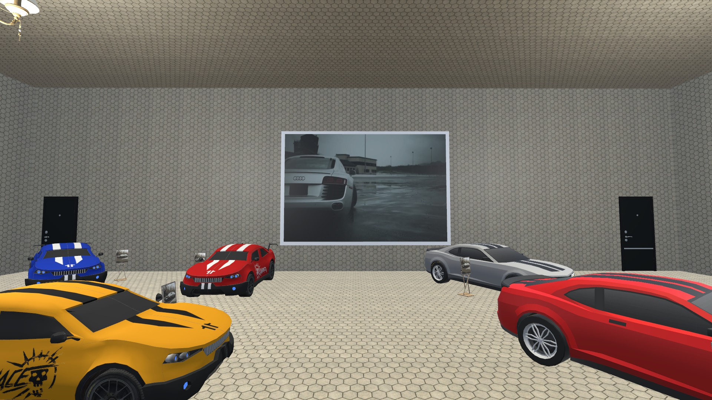

# Unity Car Showroom Project

## Project Description

This Unity project showcases a car showroom scene, featuring a collection of cars with accompanying information stands. Each car is positioned on a platform with circular motion applied. The scene is enhanced with office furniture, appropriate lighting, and decorative elements to achieve a realistic look. Additionally, four cubes are placed, each displaying a specific image on its faces (excluding the top and bottom faces) with circular motion applied. The scene also includes a video display screen for promotional videos and logos for two car manufacturing companies.

## Features

- Car showroom with interactive elements.
- Circular motion applied to cars and cubes.
- Realistic lighting and decorative elements.
- Video display for promotional content.
- Logos for two car manufacturing companies.
- Utilizes Starter Assets - First Person Controller for character navigation (Android and Windows).

## Screenshots

### Windows Version

### Android Version

## How to Run

1. Clone this repository to your local machine.
git clone https://github.com/habbas11/Car-Fair-Unity-Scene.git
2. Open the project in Unity.
3. Build and run the project for your desired platform (Windows or Android).
4. Explore the immersive car showroom scene!

## Contributors

- [HassanAlhajAli](https://github.com/HassanAlhajAli)

## Credits

- [Starter Assets - First Person Controller](https://assetstore.unity.com/packages/essentials/starterassets-firstperson-updates-in-new-charactercontroller-pac-196525)
- [Polyhaven](https://polyhaven.com/)

## License

This project is licensed under the [MIT License](https://opensource.org/license/mit/).

